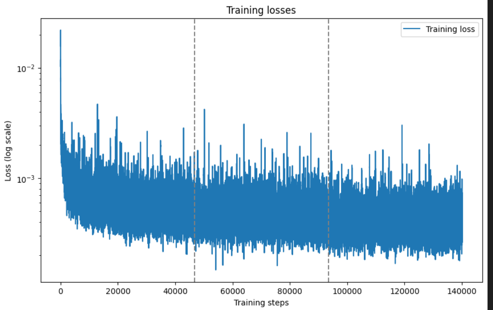

#Extractive summary Result:
## Training Graph

## Extractive summary Scores

| Top Sentences | ROUGE1 (f) | ROUGE1 (p) | ROUGE1 (r) | ROUGE2 (f) | ROUGE2 (p) | ROUGE2 (r) | ROUGEL (f) | ROUGEL (p) | ROUGEL (r) |
|---------------|------------|------------|------------|------------|------------|------------|------------|------------|------------|
| Top 10        | 0.1541     | 0.0951     | 0.5537     | 0.0349     | 0.0213     | 0.1329     | 0.0951     | 0.0579     | 0.3634     |
| Top 15        | 0.1223     | 0.0709     | 0.6144     | 0.0295     | 0.0170     | 0.1578     | 0.0762     | 0.0438     | 0.4092     |
| Top 20        | 0.1024     | 0.0576     | 0.6554     | 0.0259     | 0.0145     | 0.1768     | 0.0642     | 0.0358     | 0.4399     |
| Top 25        | 0.0885     | 0.0488     | 0.6835     | 0.0231     | 0.0127     | 0.1909     | 0.0559     | 0.0306     | 0.4635     |
| Top 30        | 0.0785     | 0.0427     | 0.7046     | 0.0211     | 0.0114     | 0.2026     | 0.0785     | 0.0427     | 0.7046     |
