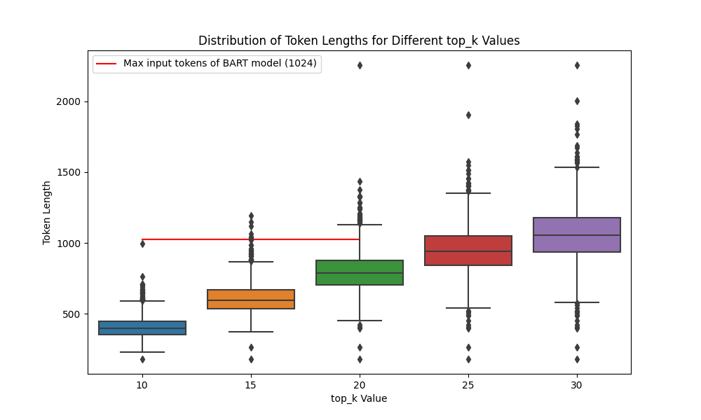

# Result 

# Extractive summary result

| Top K sentences |           Rouge 1           |           Rouge 2          |          Rouge L          |
|:---------------:|:---------------------------:|:--------------------------:|:-------------------------:|
|                 |      F      |  P   |   R    |     F     |   P  |   R     |     F     |  P   |   R    |
|       10        |   0.1531    |0.0948| 0.5375 |  0.0322   |0.0197| 0.1202  |  0.0937   |0.0573| 0.3510  |
|       15        |   0.1215    |0.0708| 0.5902 |  0.0271   |0.0157| 0.1395  |  0.0748   |0.0432| 0.3883  |
|       20        |   0.1029    |0.0582| 0.6255 |  0.0235   |0.0132| 0.1521  |  0.0637   |0.0357| 0.4140  |
|       25        |   0.0916    |0.0510| 0.6467 |  0.0213   |0.0118| 0.1604  |  0.0569   |0.0314| 0.4300  |
|       30        |   0.0851    |0.0469| 0.6581 |  0.0200   |0.0110| 0.1650  |  0.0529   |0.0290| 0.4395  |

<!-- 2023-09-17 00:25:45 [INFO]: ROUGE scores for top 10 sentences:
2023-09-17 00:25:45 [INFO]: Overall ROUGE1: {'f': 0.15305553348282447, 'p': 0.09476489390322325, 'r': 0.5375393365639517}
2023-09-17 00:25:45 [INFO]: Overall ROUGE2: {'f': 0.032161322861958455, 'p': 0.01973848147212765, 'r': 0.12023009201220831}
2023-09-17 00:25:45 [INFO]: Overall ROUGEL: {'f': 0.09373635842102661, 'p': 0.05729930631466032, 'r': 0.35100726252745806}

2023-09-17 00:25:45 [INFO]: Using default tokenizer.
2023-09-17 00:26:00 [INFO]: ROUGE scores for top 15 sentences:
2023-09-17 00:26:00 [INFO]: Overall ROUGE1: {'f': 0.12149252693177988, 'p': 0.07079496148624415, 'r': 0.5901965421707518}
2023-09-17 00:26:00 [INFO]: Overall ROUGE2: {'f': 0.027053842214719268, 'p': 0.01565248411519586, 'r': 0.13953296507202526}
2023-09-17 00:26:00 [INFO]: Overall ROUGEL: {'f': 0.07480496608406341, 'p': 0.04317980702281872, 'r': 0.38827646414265543}

2023-09-17 00:26:00 [INFO]: Using default tokenizer.
2023-09-17 00:26:20 [INFO]: ROUGE scores for top 20 sentences:
2023-09-17 00:26:20 [INFO]: Overall ROUGE1: {'f': 0.10289406636023737, 'p': 0.05817627446695529, 'r': 0.6254500873038324}
2023-09-17 00:26:20 [INFO]: Overall ROUGE2: {'f': 0.023499827342148505, 'p': 0.013201836557970519, 'r': 0.15210242300662405}
2023-09-17 00:26:20 [INFO]: Overall ROUGEL: {'f': 0.06368274200417041, 'p': 0.03572825025903921, 'r': 0.41396932285264204}

2023-09-17 00:26:20 [INFO]: Using default tokenizer.
2023-09-17 00:26:43 [INFO]: ROUGE scores for top 25 sentences:
2023-09-17 00:26:43 [INFO]: Overall ROUGE1: {'f': 0.09157385264647767, 'p': 0.050952672995538434, 'r': 0.6466505550025012}
2023-09-17 00:26:43 [INFO]: Overall ROUGE2: {'f': 0.02133923477003398, 'p': 0.011802139683437478, 'r': 0.16042540301997463}
2023-09-17 00:26:43 [INFO]: Overall ROUGEL: {'f': 0.05686104702637608, 'p': 0.031418476067021216, 'r': 0.4300415561037496}

2023-09-17 00:26:43 [INFO]: Using default tokenizer.
2023-09-17 00:27:09 [INFO]: ROUGE scores for top 30 sentences:
2023-09-17 00:27:09 [INFO]: Overall ROUGE1: {'f': 0.08505767945488014, 'p': 0.04693360386512862, 'r': 0.6580925162316399}
2023-09-17 00:27:09 [INFO]: Overall ROUGE2: {'f': 0.02001923392007285, 'p': 0.010980648281181376, 'r': 0.1649593806873701}
2023-09-17 00:27:09 [INFO]: Overall ROUGEL: {'f': 0.052929236170548226, 'p': 0.02901261300094679, 'r': 0.4394664821286527} -->