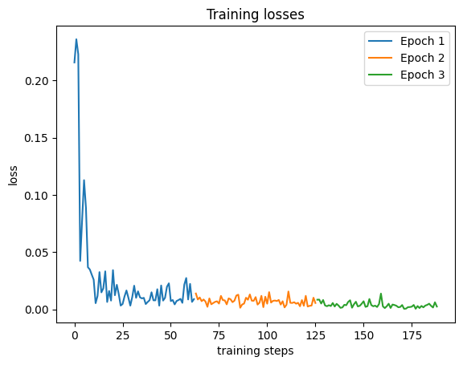

# `Initial Result`

## Parameter
### No. of Sample training sample: 500 
### No. of validation sample: 50

### args=Namespace(bs=8, n_epoch=3, lr=3e-05, model_dir='checkpoint')

### Device: Device 0: NVIDIA A100-SXM4-40GB 

### Loss:
* [Epoch 1] Trainning loss: 0.0284
* [Epoch 1] Val loss: 0.0011
* [Epoch 2] Trainning loss: 0.0073
* [Epoch 2] Val loss = 0.0029
* [Epoch 3] Trainning loss: 0.0038
* [Epoch 3] Val loss = 0.0012

## Training validation Graph:

